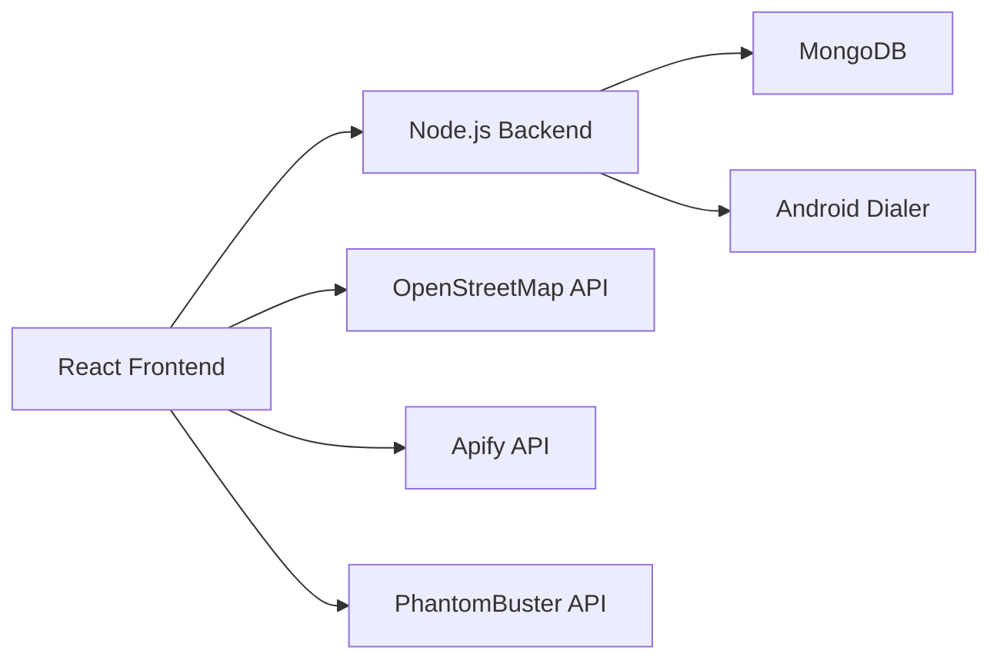

# 🚀 LeadEngine CRM - نظام إدارة العملاء المحتملين

<div align="center">


**نظام CRM متكامل لإدارة العملاء المحتملين مع اتصال تلقائي عبر Android**

[المميزات](#-المميزات) • [البدء السريع](#-البدء-السريع) • [البنية](#-البنية-المعمارية) • [الصفحات](#-الصفحات) • [التوثيق](#-التوثيق)

</div>

---

## 📋 نظرة عامة

LeadEngine CRM هو نظام شامل لإدارة علاقات العملاء المحتملين يتميز بـ:

- ✅ **إدارة كاملة للعملاء المحتملين** (Leads Management)
- ✅ **نظام اتصال تلقائي** (Auto-Dial Queue)
- ✅ **تحليلات متقدمة** (Advanced Analytics)
- ✅ **استيراد CSV** (Bulk Import)
- ✅ **ربط Android Dialer** للاتصال المباشر
- ✅ **قوالب رسائل Email & WhatsApp**
- ✅ **سجل أنشطة مفصل** (Activity Timeline)
- ✅ **تقارير شاملة** مع رسوم بيانية
- ✅ **دعم كامل للغة العربية RTL**

---

## ✨ المميزات

### 🎯 الميزات الأساسية

| الميزة | الوصف |
|--------|--------|
| **إدارة العملاء** | إضافة، تعديل، حذف، وتتبع حالة العملاء المحتملين |
| **إدارة المكالمات** | تسجيل المكالمات، متابعة النتائج، جدولة المتابعات |
| **التقارير** | تقارير تفصيلية عن الأداء مع رسوم بيانية |
| **صلاحيات المستخدمين** | 3 أدوار (Admin, Sales, Manager) |
| **التقويم** | جدولة الاجتماعات والمتابعات |

### 🚀 الميزات المتقدمة

#### 1. **Auto-Dial Queue** 🔄
- قائمة اتصال تلقائية
- ترتيب الأولويات
- التحكم في Play/Pause/Skip
- تتبع التقدم

#### 2. **Advanced Analytics** 📊
- 5 أقسام تحليلية
- KPIs تفصيلية
- مقارنة أداء الفريق
- تحليل المصادر

#### 3. **CSV Import** 📥
- رفع ملفات CSV
- معاينة قبل الاستيراد
- التحقق من صحة البيانات
- كشف المكررات

#### 4. **Settings** ⚙️
- إعدادات عامة
- إشعارات
- Android Dialer
- قاعدة البيانات
- SMTP & WhatsApp

#### 5. **Notifications** 🔔
- إشعارات فورية
- 3 مستويات أولوية
- تصنيفات متعددة
- تعليم كمقروء

#### 6. **Activity Timeline** 📋
- سجل مفصل للأنشطة
- فلاتر متقدمة
- تجميع حسب التاريخ
- Timeline بصري

#### 7. **Templates** 📧
- قوالب Email
- قوالب WhatsApp
- متغيرات ديناميكية
- تحرير ونسخ القوالب

---

## 🏗️ البنية المعمارية



### التقنيات المستخدمة

#### Frontend
- ⚛️ **React 18.3.1** - UI Framework
- 🎨 **Tailwind CSS 4.0** - Styling
- 📝 **TypeScript** - Type Safety
- 🧭 **React Router 7** - Navigation
- 📊 **Recharts** - Data Visualization
- 🎭 **Radix UI** - Component Library
- 🔔 **Sonner** - Notifications
- 📅 **date-fns** - Date Utilities

#### Backend (للإنشاء - راجع BACKEND_INTEGRATION.md)
- 🟢 **Node.js + Express** - Server
- 🍃 **MongoDB + Mongoose** - Database
- 🔐 **JWT** - Authentication
- 📧 **Nodemailer** - Email
- 💬 **WhatsApp API** - Messaging

#### Mobile
- 📱 **Android (Kotlin)** - Dialer App

---

## 🚀 البدء السريع

### المتطلبات

- Node.js 18+
- npm أو pnpm

### التثبيت

```bash
# 1. Clone المشروع
git clone https://github.com/your-repo/leadengine-crm.git
cd leadengine-crm

# 2. تثبيت الحزم
npm install

# 3. تشغيل المشروع
npm run dev

# 4. فتح المتصفح
# http://localhost:5173
```

### تسجيل الدخول (Mock Data)

```
Admin:
- Email: ahmed@leadengine.com
- Password: أي كلمة مرور

Sales:
- Email: sarah@leadengine.com
- Password: أي كلمة مرور
```

---

## 📱 الصفحات

### 1. 🏠 الصفحة الرئيسية (`/dashboard`)
- نظرة عامة على الإحصائيات
- KPIs رئيسية
- رسوم بيانية

### 2. 👥 العملاء المحتملين (`/dashboard/leads`)
- جدول العملاء
- فلاتر متقدمة
- إضافة/تعديل/حذف

### 3. 📞 المكالمات (`/dashboard/calls`)
- سجل المكالمات
- تسجيل مكالمة جديدة
- متابعة النتائج

### 4. 🔄 الاتصال التلقائي (`/dashboard/auto-dial`)
- قائمة انتظار
- التحكم في الاتصال
- تتبع التقدم

### 5. 📥 استيراد CSV (`/dashboard/import`)
- رفع ملفات CSV
- معاينة البيانات
- تقرير الاستيراد

### 6. 📋 سجل الأنشطة (`/dashboard/activity`)
- Timeline الأنشطة
- فلاتر متقدمة
- تفاصيل كل نشاط

### 7. 📧 قوالب الرسائل (`/dashboard/templates`)
- قوالب Email
- قوالب WhatsApp
- متغيرات ديناميكية

### 8. 📅 المتابعات (`/dashboard/calendar`)
- تقويم الاجتماعات
- جدولة المتابعات

### 9. 📊 التقارير (`/dashboard/reports`)
- تقارير المبيعات
- تقارير الأداء
- رسوم بيانية

### 10. 📈 التحليلات المتقدمة (`/dashboard/analytics`)
- 5 أقسام تحليلية
- مقارنات متقدمة
- تحليل المصادر

### 11. ⚙️ الإعدادات (`/dashboard/settings`)
- إعدادات عامة
- إشعارات
- Android Dialer
- قاعدة البيانات
- SMTP & APIs

### 12. 👤 المستخدمين (`/dashboard/users`)
- إدارة المستخدمين (Admin فقط)
- تعيين الصلاحيات

---

## 📊 Data Models

### User
```typescript
{
  _id: string;
  name: string;
  email: string;
  role: 'admin' | 'sales' | 'manager';
  phone?: string;
  createdAt: string;
}
```

### Lead
```typescript
{
  _id: string;
  company_name: string;
  phone: string;
  email?: string;
  website?: string;
  industry: string;
  city: string;
  source: 'osm' | 'apify' | 'phantombuster' | 'manual' | 'linkedin';
  status: 'new' | 'contacted' | 'followup' | 'meeting' | 'closed' | 'lost';
  assigned_to?: string;
  notes?: string;
  createdAt: string;
  updatedAt: string;
}
```

### Call
```typescript
{
  _id: string;
  lead_id: string;
  user_id: string;
  result: 'answered' | 'no_answer' | 'busy' | 'rejected' | 'voicemail';
  duration: number;
  notes?: string;
  next_followup?: string;
  created_at: string;
}
```

---

## 🔌 مصادر جمع البيانات

### 1. OpenStreetMap (مجاني 100%)
```javascript
// استخدام Overpass API
const query = `
  [out:json];
  node["shop"="construction"](around:10000,30.0444,31.2357);
  out;
`;
```

### 2. Apify
- actors جاهزة لـ Google Maps
- Free tier متاح

### 3. PhantomBuster
- LinkedIn scraping
- Free tier 14 days

### 4. Manual / CSV Import
- استيراد يدوي
- ملفات CSV

---

## 📱 Android Dialer Setup

### تثبيت التطبيق

1. قم ببناء تطبيق Android بسيط
2. يعمل كـ Web Server على Port 8080
3. يستقبل أوامر الاتصال من Backend
4. يرسل نتائج المكالمات

### Example Code

```kotlin
// في Android App
val intent = Intent(Intent.ACTION_CALL)
intent.data = Uri.parse("tel:$phoneNumber")
startActivity(intent)
```

راجع `BACKEND_INTEGRATION.md` للتفاصيل الكاملة.

---

## 🔐 Authentication

النظام يدعم 3 أدوار:

| الدور | الصلاحيات |
|------|-----------|
| **Admin** | جميع الصلاحيات + إدارة المستخدمين |
| **Sales** | إدارة العملاء والمكالمات المسندة له |
| **Manager** | عرض التقارير والإحصائيات فقط |

---

## 📖 التوثيق

- 📘 [BACKEND_INTEGRATION.md](./BACKEND_INTEGRATION.md) - دليل ربط Backend
- 📗 [INTEGRATION_GUIDE.md](./INTEGRATION_GUIDE.md) - دليل التكامل العام

---

## 🛠️ التطوير

### البنية

```
src/
├── app/
│   ├── components/         # React Components
│   │   ├── ui/            # UI Components (Radix)
│   │   ├── AddLeadModal.tsx
│   │   ├── CallModal.tsx
│   │   └── NotificationsCenter.tsx
│   ├── contexts/          # React Contexts
│   │   └── AuthContext.tsx
│   ├── data/              # Mock Data
│   │   └── mockData.ts
│   ├── pages/             # Pages
│   │   ├── LoginPage.tsx
│   │   ├── DashboardHome.tsx
│   │   ├── LeadsPage.tsx
│   │   ├── AutoDialPage.tsx
│   │   ├── AnalyticsPage.tsx
│   │   ├── ImportCSVPage.tsx
│   │   ├── SettingsPage.tsx
│   │   ├── ActivityTimelinePage.tsx
│   │   ├── TemplatesPage.tsx
│   │   └── ...
│   ├── services/          # API Services (للإنشاء)
│   │   └── api.ts
│   ├── types.ts           # TypeScript Types
│   ├── routes.tsx         # React Router
│   └── App.tsx
└── styles/                # CSS Files
```

### إضافة صفحة جديدة

```typescript
// 1. إنشاء الصفحة
// src/app/pages/NewPage.tsx
export default function NewPage() {
  return <div>New Page</div>;
}

// 2. إضافة Route
// src/app/routes.tsx
import NewPage from './pages/NewPage';

{
  path: 'new-page',
  element: <NewPage />,
}

// 3. إضافة في القائمة
// src/app/pages/DashboardLayout.tsx
{ icon: Star, label: 'صفحة جديدة', path: '/dashboard/new-page' }
```

---

## 🚢 Deployment

### Frontend

```bash
# Build
npm run build

# Deploy to Vercel/Netlify
# رفع مجلد dist/
```

### Backend

راجع `BACKEND_INTEGRATION.md` للتفاصيل.

---

## 📊 الإحصائيات

- **13 صفحة** رئيسية
- **50+ Component** قابل لإعادة الاستخدام
- **دعم كامل RTL**
- **Responsive Design**
- **Mock data** جاهز للتطوير

---

## 🤝 المساهمة

المساهمات مرحب بها! الرجاء:

1. Fork المشروع
2. إنشاء branch جديد (`git checkout -b feature/AmazingFeature`)
3. Commit تغييراتك (`git commit -m 'Add some AmazingFeature'`)
4. Push إلى Branch (`git push origin feature/AmazingFeature`)
5. فتح Pull Request

---

## 📝 License

هذا المشروع مفتوح المصدر.

---

## 📞 الدعم

للدعم والمساعدة:
- 📧 Email: support@leadengine.com
- 💬 Discord: [Join Server](#)
- 📖 Docs: [Documentation](#)

---

## 🙏 شكر خاص

شكراً لجميع المساهمين في المشروع والمكتبات مفتوحة المصدر المستخدمة.

---

<div align="center">

**صُنع بـ ❤️ في مصر**

[⬆ العودة للأعلى](#-leadengine-crm---نظام-إدارة-العملاء-المحتملين)

</div>
